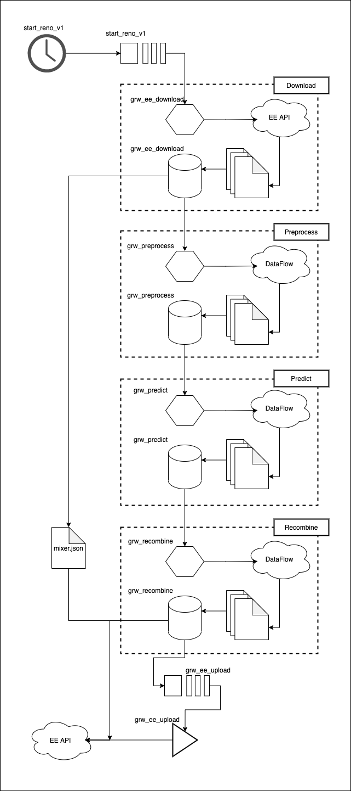

# global_renosterveld_watch

## what is it?
This repository contains the code and instructions for building an automation pipeline for the renosterveld monitor found here [`renosterveld-monitor`](https://github.com/GMoncrieff/renosterveld-monitor). 

## how does it work?
The `renosterveld-monitor` works by pulling down satellite imagery from Google's [Earth Engine](https://earthengine.google.com/), transforming that data, running the data through a model that predicts areas of renosterveld that have been transformed, and then uploading a new layer to Earth Engine. 

The `global_renosterveld_watch` orchestrates this whole process through cloud services so that this workflow is automatically run on a regular period. 

### architecture
The pipeline is shown in the diagram below. It consists of five stages all triggered by the [google cloud scheduler](https://cloud.google.com/scheduler/). 

#### `download`
The download is a [cloud function](https://cloud.google.com/functions/) triggered by the `start_reno_v1` [pub sub topic](https://cloud.google.com/pubsub/). It simply builds an Earth Engine API call that downloads transformed layers of satellite data into the `grw_ee_download` [bucket](https://cloud.google.com/storage/). The layers are downloaded as GZIPed TFRecords. The size of these records are controlled by a `maxFileSize` parameter which allows us to, in turn, control the batch size of the data throughout the pipeline. In addition to the TFRecords, a `mixer.json` file is also downloaded which is used on upload (final stage of the pipeline) to allow the Earth Engine API to reconstitute the spatial relationships in the layers. 

#### `preprocess`
Each of the next three stages of the pipeline (preprocess through recombine) are composed of a cloud function and a [dataflow template](https://cloud.google.com/dataflow/docs/concepts/dataflow-templates). The cloud function is simply responsible for waiting for the last artifact from the previous stage in the pipeline to drop so it can kick off a dataflow job. The dataflow job is defined by the dataflow template which are essentially just dockerized apache beam jobs. When triggering the dataflow job, the cloud functions also specify the type and number of workers allowed. 

The preprocess job itself is responsible for performing any transformations on the data required to prepare it for predictions. Amongst other things, two parts of this transformation are extremely important.

1. As we are processing this data using parallelization across workers there is no longer any guarantee that our data remains in the right order. This is a significant issue because Earth Engine is expecting the data back in the same order we downloaded it in. Therefore one critical component of the preprocess pipeline is to attach a key to each data record that will allow us to reconstitute the ordering before upload (during recombine). 
2. While the google cloud machine learning platform is not mature enough yet to support our requirements we still would like to be able to use it once it matures. Therefore the preprocess pipeline also transforms the data into a form that could be used by the machine learning cloud platform. 

#### `predict`

